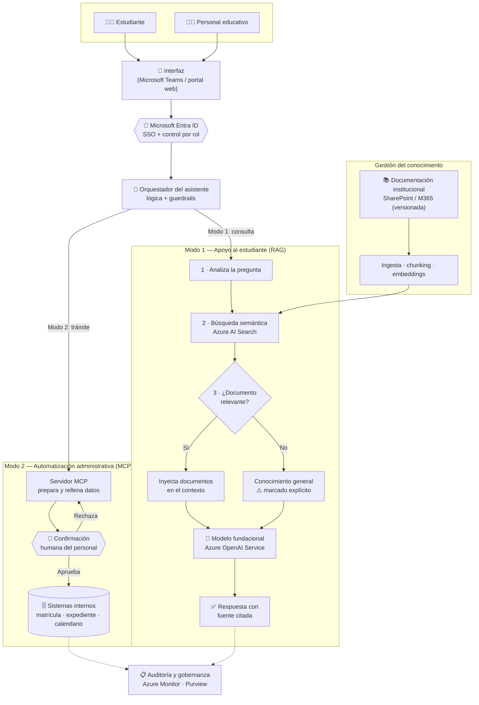

# Fase 2 — Componente de IA Generativa: Asistente Virtual

**Proyecto:** Solución integral de IA para la prevención del abandono estudiantil
**Fase:** 2 — Diseño conceptual del asistente virtual basado en IA generativa
**Entorno de referencia:** Microsoft Azure (la institución ya opera sobre el ecosistema Microsoft)

---

## 1. Objetivo y alcance

El asistente virtual es el componente conversacional de la solución. Su misión es **mejorar la experiencia del estudiante y apoyar al personal educativo**, resolviendo dudas y automatizando trámites, de modo que el personal humano pueda dedicar su tiempo a las tareas de mayor valor (acompañamiento, tutoría, intervención sobre los alumnos en riesgo que detecta el modelo de la Fase 1).

El asistente opera en **dos modos** con perfiles de riesgo y diseños distintos:

- **Modo 1 — Apoyo académico al estudiante:** responde dudas académicas y administrativas mediante un enfoque **RAG** (Retrieval-Augmented Generation) anclado en la documentación oficial de la institución.
- **Modo 2 — Automatización administrativa (personal):** asiste al personal en tareas administrativas (rellenado de formularios, gestión de trámites) apoyándose en un **servidor MCP**, siempre con **confirmación humana antes de escribir en los sistemas**.

> **Principio rector:** la IA *propone y prepara*; el humano *decide y aprueba*. El asistente complementa al personal, nunca lo sustituye en las decisiones con consecuencias reales.

---

## 2. Arquitectura propuesta

### 2.1 Visión general

### 2.2 Modelo fundacional

Se utiliza un **modelo fundacional de lenguaje** servido a través de **Azure OpenAI Service**, que aporta:

- Comprensión y generación de lenguaje natural sin necesidad de entrenar un modelo desde cero.
- Despliegue dentro del perímetro de seguridad y cumplimiento de Azure (los datos no se usan para reentrenar el modelo base del proveedor).
- Residencia de datos en la región europea adecuada para la normativa de protección de datos.

El modelo **no se usa "en crudo"**: su comportamiento se acota mediante instrucciones de sistema (rol, tono, límites) y se ancla en el conocimiento institucional mediante RAG.

### 2.3 Flujo del Modo 1 — RAG con trazabilidad de fuente

1. **Análisis de la pregunta:** el orquestador recibe el *prompt* del estudiante.
2. **Recuperación:** se consulta el índice de **Azure AI Search** sobre la base documental institucional, normalmente mediante **búsqueda semántica** (los documentos se indexan como *embeddings* vectoriales para encontrar el tema correcto aunque la pregunta no use las mismas palabras exactas).
3. **Decisión de fuente:**
   - **Si hay documentos relevantes** → se inyectan en el contexto del modelo y la respuesta se construye **a partir de ellos**, citando la fuente oficial.
   - **Si no hay documentos relevantes** en la base de conocimiento → la respuesta se genera con el **conocimiento general del modelo**, indicándolo **explícitamente** al usuario (p. ej.: *"No he encontrado esto en la documentación oficial; la siguiente respuesta proviene de mi conocimiento general y conviene verificarla con secretaría"*).
4. **Generación y entrega:** la respuesta se devuelve al estudiante con su fuente claramente señalada.

Este diseño convierte una posible alucinación silenciosa en una respuesta con su **nivel de confianza explícito**.

### 2.4 Flujo del Modo 2 — Automatización administrativa con MCP

1. El personal solicita una tarea (p. ej., "registra la solicitud de cambio de grupo de este alumno").
2. El **servidor MCP** expone de forma controlada las herramientas/acciones disponibles sobre los sistemas internos, y el asistente **prepara y rellena** los datos del trámite.
3. **Antes de comitear**, el asistente presenta un resumen de la acción y **solicita confirmación explícita** al personal.
4. Solo tras la aprobación humana se ejecuta la escritura en el sistema. Toda acción queda **registrada (auditoría)**.

La IA hace el trabajo tedioso; la persona conserva el control y la responsabilidad de toda escritura.

---

## 3. Gestión del conocimiento institucional

La base de conocimiento es el activo que determina la calidad del Modo 1. Su gestión contempla:

- **Fuentes:** normativa académica, guías de matrícula, calendarios, preguntas frecuentes, reglamentos, procedimientos administrativos — preferentemente desde **SharePoint / Microsoft 365**, que la institución ya usa.
- **Ingesta e indexación:** los documentos se trocean (*chunking*), se convierten en *embeddings* y se almacenan en el índice vectorial de **Azure AI Search**.
- **Versionado y vigencia:** cada documento mantiene fecha y versión, de modo que el RAG no responda sobre información obsoleta. La información desactualizada es tan peligrosa como la inventada.
- **Gobernanza (Microsoft Purview):** catalogación, clasificación por sensibilidad y trazabilidad del linaje (saber de qué documento sale cada respuesta).
- **Actualización continua:** proceso periódico de reindexación cuando cambia la documentación oficial, con responsable designado del mantenimiento de la base.
- **Control de acceso a nivel de documento:** la recuperación respeta los permisos del usuario, de forma que el RAG **solo busca en las fuentes que el solicitante tiene derecho a ver**.

---

## 4. Mecanismos para minimizar errores y alucinaciones

| Mecanismo | Cómo reduce el error |
|---|---|
| **RAG (anclaje en documentación)** | La respuesta se basa en textos oficiales recuperados, no en el conocimiento "libre" del modelo. |
| **Divulgación explícita de la fuente** | Cuando no hay documento, se avisa de que la respuesta es conocimiento general → el usuario sabe que debe verificar. |
| **Citación de fuentes** | Cada respuesta del Modo 1 enlaza al documento de origen, permitiendo la comprobación. |
| **Confirmación humana (Modo 2)** | Ninguna escritura administrativa ocurre sin aprobación de una persona. |
| **Instrucciones de sistema y *guardrails*** | Acotan el rol del asistente y filtran entradas/salidas inapropiadas o fuera de alcance. |
| **Base de conocimiento versionada** | Evita responder con información caducada. |
| **Derivación a humano** | En temas delicados o sin respuesta fiable, el asistente escala a una persona en lugar de improvisar. |
| **Umbral de relevancia en la búsqueda** | Si los documentos recuperados no superan un umbral de similitud, se trata como "sin fuente" en lugar de forzar una respuesta. |

---

## 5. Criterios de supervisión humana (human-in-the-loop)

La supervisión humana se gradúa según el riesgo de la acción:

- **Consultas informativas (Modo 1):** autonomía del asistente, pero con **fuente citada** para que el estudiante (y el personal) pueda verificar. La supervisión es *a posteriori*, mediante revisión de registros y métricas.
- **Acciones administrativas (Modo 2):** **confirmación obligatoria previa** a cualquier escritura en los sistemas. La persona es el decisor final.
- **Temas sensibles** (salud mental, situaciones personales, conflictos): **derivación directa a personal humano**; el asistente no intenta resolverlos.
- **Bucle de mejora continua:** registro de conversaciones (con las debidas garantías de privacidad), identificación de respuestas deficientes y retroalimentación para mejorar la base de conocimiento y las instrucciones del sistema.

> El asistente nunca toma decisiones irreversibles o con impacto directo sobre el expediente del estudiante sin validación humana.

---

## 6. Seguridad y protección de datos

- **Identidad y acceso (Microsoft Entra ID):** autenticación única (SSO) reutilizando las credenciales institucionales; control de accesos **por rol** (estudiante / personal / administrador), que además condiciona qué puede recuperar el RAG.
- **Cifrado:** datos cifrados en reposo y en tránsito por defecto.
- **Gestión de secretos (Azure Key Vault):** claves, tokens y credenciales del servidor MCP centralizados y protegidos.
- **Aislamiento de red (Private Endpoints):** los servicios de IA no quedan expuestos públicamente a internet.
- **Residencia y soberanía de datos:** despliegue en la región europea adecuada para cumplir la normativa de protección de datos (GDPR), tratándose de datos personales sensibles de estudiantes.
- **Privacidad y confidencialidad:** segregación estricta de datos entre usuarios — el asistente no puede exponer información de un estudiante a otro.
- **Minimización de datos:** el asistente solo accede a los datos estrictamente necesarios para la tarea.
- **No reentrenamiento con datos institucionales:** mediante Azure OpenAI, los datos de la institución no se emplean para entrenar los modelos del proveedor.
- **Auditoría (Azure Monitor / Application Insights):** trazabilidad de las acciones del asistente, especialmente de las escrituras administrativas, para rendición de cuentas.

---

## 7. Encaje con la solución global

El asistente no es una pieza aislada: se integra con el **modelo predictivo de la Fase 1** y con la **arquitectura cloud de la Fase 3**. Por ejemplo, cuando el modelo detecta a un estudiante en riesgo, el asistente puede **facilitar al tutor la información y los trámites de la intervención** (agendar tutoría, enviar recursos de apoyo), cerrando el ciclo entre *detección* (modelo) y *acción* (asistente + personal). Todo ello sobre una identidad unificada (Entra ID) y una gobernanza de datos centralizada (Purview).

---

## 8. Resumen

| Elemento | Decisión de diseño |
|---|---|
| Modelo | Modelo fundacional vía Azure OpenAI Service |
| Enfoque | RAG (Modo 1) + automatización con servidor MCP (Modo 2) |
| Conocimiento | Azure AI Search sobre documentación institucional versionada (SharePoint/M365) |
| Anti-alucinaciones | Anclaje en fuentes + divulgación explícita cuando la respuesta es conocimiento general |
| Supervisión humana | Confirmación obligatoria antes de toda escritura; derivación en temas sensibles |
| Seguridad | Entra ID (SSO + roles), cifrado, Key Vault, redes privadas, residencia UE, auditoría |
| Principio rector | La IA propone y prepara; el humano decide y aprueba |
