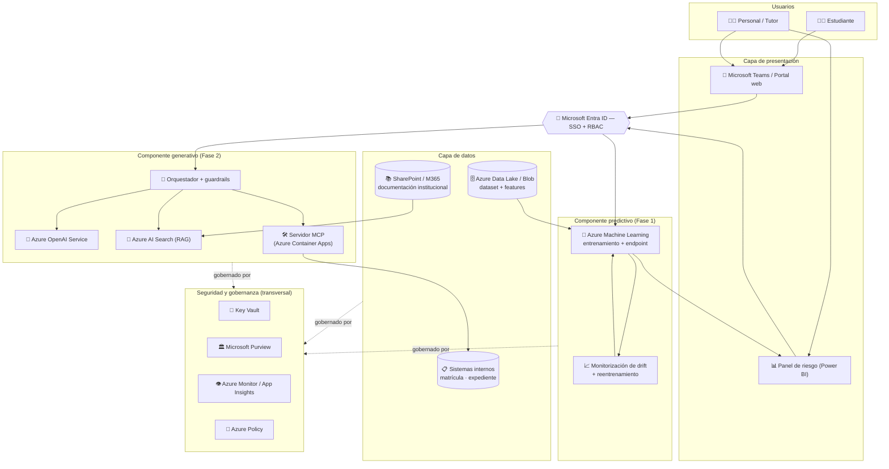

# Fase 3 — Elección del entorno Cloud y arquitectura simplificada

**Proyecto:** Solución integral de IA para la prevención del abandono estudiantil
**Fase:** 3 — Arquitectura cloud global (integra Fase 1 — modelo predictivo — y Fase 2 — asistente virtual)
**Proveedor elegido:** Microsoft Azure

---

## 1. Elección del proveedor cloud

La institución ya opera sobre el **ecosistema Microsoft** (Microsoft 365, Teams, Active Directory). Por ello, el proveedor elegido es **Microsoft Azure**. La decisión no responde solo a la afinidad: cuando el resto de la organización ya vive en un ecosistema, elegir el mismo proveedor **maximiza la integración y minimiza la fricción de adopción**, que suele ser el verdadero cuello de botella de un proyecto de IA. Además, Azure ofrece servicios gestionados maduros tanto para *machine learning* clásico (modelo predictivo) como para IA generativa (asistente), permitiendo que ambos componentes convivan bajo una única plataforma, identidad y gobernanza.

> Una diferencia marginal de rendimiento frente a AWS o GCP no compensa la pérdida de integración nativa con la identidad, la ofimática y los repositorios documentales que la institución **ya** utiliza.

---

## 2. Arquitectura global

**Lectura del flujo:** los usuarios acceden por Teams/portal (estudiantes) o por un panel Power BI (personal), siempre autenticados por **Entra ID**. El **componente predictivo** consume datos del *data lake*, expone un *endpoint* de predicción y vuelca el riesgo al panel del tutor. El **componente generativo** atiende consultas (RAG sobre la documentación) y trámites (MCP sobre los sistemas internos). Toda la plataforma está atravesada por una capa transversal de **seguridad y gobernanza**.

---

## 3. Servicios concretos por capa

| Capa | Servicio Azure | Función |
|---|---|---|
| **Identidad** | **Microsoft Entra ID** | SSO con las credenciales institucionales; control de acceso por rol (RBAC) que condiciona qué ve cada usuario y qué recupera el RAG. |
| **Presentación** | **Microsoft Teams**, **Power BI** | Canal del asistente (donde los usuarios ya están) y panel de visualización del riesgo para tutores. |
| **Modelo predictivo** | **Azure Machine Learning** | Entrenamiento, registro de modelos, despliegue como *endpoint* gestionado, y monitorización de *drift* con reentrenamiento. |
| **IA generativa** | **Azure OpenAI Service** | Modelo fundacional que genera las respuestas del asistente. |
| **Recuperación (RAG)** | **Azure AI Search** | Índice vectorial/semántico sobre la documentación institucional. |
| **Automatización** | **Azure Container Apps** (servidor MCP) + **Power Automate** | Ejecuta los trámites administrativos, con confirmación humana previa. |
| **Datos** | **Azure Data Lake / Blob Storage** | Almacenamiento del dataset, *features* y artefactos del modelo. |
| **Conocimiento** | **SharePoint / Microsoft 365** | Fuente documental oficial (ya existente) que alimenta el RAG. |
| **Secretos** | **Azure Key Vault** | Claves, tokens y credenciales (p. ej., del servidor MCP). |
| **Gobernanza** | **Microsoft Purview**, **Azure Policy** | Catálogo, clasificación y linaje de datos; aplicación automática de reglas de cumplimiento. |
| **Observabilidad** | **Azure Monitor / Application Insights** | Auditoría de acciones, métricas de uso y rendimiento, trazabilidad de escrituras. |
| **Red** | **Private Endpoints / VNet** | Aislamiento de los servicios de IA frente a internet. |

---

## 4. Justificación según los criterios estratégicos

### 4.1 Escalabilidad
- La carga es **estacional y predecible** (picos en matrícula y exámenes). Se priorizan servicios **serverless / con autoescalado** —Azure Container Apps para el MCP, *endpoints* gestionados de Azure ML, consumo por tokens en Azure OpenAI— para **pagar por uso real** y absorber los picos sin sobredimensionar.
- El dataset es pequeño hoy, pero la arquitectura (data lake + servicios gestionados) permite crecer a decenas de miles de estudiantes **sin rediseño**.

### 4.2 Integración
- **Identidad unificada (Entra ID):** un único inicio de sesión para el asistente, el panel y los sistemas internos.
- **Teams y M365 nativos:** el asistente se despliega donde el usuario ya trabaja, y SharePoint actúa como fuente documental sin migraciones.
- **Convivencia model + asistente:** ambos componentes comparten plataforma, datos e identidad, reduciendo el coste de mantener piezas dispersas. El modelo predictivo *detecta* y el asistente *facilita la acción*, cerrando el ciclo.

### 4.3 Gobernanza
- **Microsoft Purview** cataloga y clasifica los datos por sensibilidad y traza su linaje (qué datos alimentan el modelo y de qué documento sale cada respuesta del RAG).
- **Azure Policy** impone reglas de cumplimiento de forma automática en toda la infraestructura (regiones permitidas, cifrado obligatorio, etiquetado).
- **Azure Monitor** garantiza la auditoría y la rendición de cuentas, especialmente de las escrituras administrativas.

### 4.4 Cumplimiento normativo
- **Residencia de datos:** despliegue en **región europea**, requisito para la normativa de protección de datos (**GDPR**) al tratar datos personales sensibles de estudiantes.
- **Cifrado** en reposo y en tránsito por defecto; **Key Vault** para la gestión de secretos; **redes privadas** para evitar exposición pública.
- **Privacidad por diseño:** minimización de datos, segregación entre usuarios y RBAC.
- **Sin reentrenamiento con datos institucionales:** mediante Azure OpenAI, los datos de la institución no se usan para entrenar los modelos del proveedor.

---

## 5. Resumen

| Criterio | Cómo lo resuelve la arquitectura |
|---|---|
| **Escalabilidad** | Servicios serverless/gestionados con autoescalado y pago por uso; crecimiento sin rediseño. |
| **Integración** | Entra ID + Teams + M365 nativos; modelo y asistente sobre una sola plataforma. |
| **Gobernanza** | Purview (linaje y clasificación) + Azure Policy (cumplimiento automático) + Monitor (auditoría). |
| **Cumplimiento** | Residencia UE/GDPR, cifrado, Key Vault, redes privadas, sin reentrenamiento con datos propios. |

**Conclusión:** Azure es la elección idónea porque permite integrar el modelo predictivo y el asistente generativo en un entorno **escalable, seguro y gobernado de forma centralizada**, apoyándose en la identidad y las herramientas que la institución ya utiliza. La arquitectura cierra el ciclo completo de la solución: **detectar** el riesgo de abandono (Fase 1), **actuar** sobre él mediante el asistente y el personal (Fase 2), todo ello sobre una base cloud que cumple los requisitos estratégicos y normativos (Fase 3).
